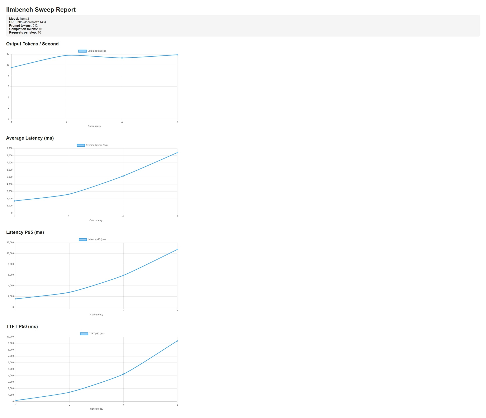

# llmbench

Benchmark and analyze performance of OpenAI-compatible LLM endpoints.

Metrics:
- latency — end-to-end request latency
- time-to-first-token — delay before first token arrives
- token throughput — tokens generated per second
- concurrency scaling — throughput vs parallel requests
- streaming token timing — inter-token latency

Designed for systems like:
- vLLM
- llama.cpp
- Ollama
- OpenAI-compatible APIs

## Quick Start

Install:

```bash
go install github.com/JanFalkin/llmbench@latest
```

Run a benchmark:

```bash
llmbench benchmark \
  --url http://localhost:11434 \
  --model llama3 \
  --requests 5 \
  --concurrency 2 \
  --completion-tokens 16
```

For authenticated endpoints pass your API key via flag or environment variable:

```bash
# via flag
llmbench benchmark --api-key sk-... --url https://api.openai.com --model gpt-4o-mini

# via environment variable
export LLMBENCH_API_KEY=sk-...
llmbench benchmark --url https://api.openai.com --model gpt-4o-mini
```

Example output:

```text
Requests:           5
Successful:         5
Failed:             0
Elapsed:            13.332880403s
Requests/sec:       0.38
Output tokens/sec:  6.00
URL:                http://localhost:11434
Model:              llama3
Prompt tokens:      512
Completion tokens:  16
Concurrency:        2

Avg Latency:        5.070435294s
Latency p50/p95:    2.708161626s / 7.976055943s
TTFT p50/p95:       1.44212132s / 6.737083255s

```

Run a sweep:

```bash
llmbench sweep \
  --url http://localhost:11434 \
  --model llama3 \
  --requests 16 \
  --completion-tokens 16 \
  --concurrency 1,2,4
```

Example output:

```text
Concurrency   Success   Req/sec   Tok/sec   Lat p50       Lat p95
-----------------------------------------------------------------
1             16/16     0.72      11.52     1.387377436s 1.399095169s
2             16/16     0.74      11.77     2.659929337s 2.800495294s
4             16/16     0.70      11.21     5.614021364s 5.874859306s
```

## CSV Output

Both `benchmark` and `sweep` support self-describing CSV output via `--format csv`. Every row includes `model`, `url`, and an optional `--label` so you can safely concatenate runs from multiple experiments into a single file.

### benchmark CSV

```bash
llmbench benchmark \
  --url http://localhost:11434 \
  --model llama3 \
  --label local-ollama \
  --completion-tokens 16 \
  --requests 2 \
  --concurrency 1 \
  --format csv > bench.csv
```

```csv
model,url,label,request_id,success,http_status,input_tokens,output_tokens,end_to_end_ms,ttft_ms,decode_ms,error
llama3,http://localhost:11434,local-ollama,req-1,true,200,512,16,7912,6675,1236,
llama3,http://localhost:11434,local-ollama,req-2,true,200,512,16,1400,147,1252,
```

### sweep CSV

```bash
llmbench sweep \
  --url http://localhost:11434 \
  --model llama3 \
  --label local-ollama \
  --requests 16 \
  --completion-tokens 16 \
  --concurrency 1,2,4 \
  --format csv > sweep.csv
```

```csv
model,url,label,concurrency,total_requests,successful_requests,failed_requests,elapsed_ms,requests_per_second,output_tokens_per_second,avg_latency_ms,latency_p50_ms,latency_p95_ms,ttft_p50_ms,ttft_p95_ms
llama3,http://localhost:11434,local-ollama,1,16,16,0,21974,0.728116,11.649852,1373,1369,1385,142,146
llama3,http://localhost:11434,local-ollama,2,16,16,0,21121,0.757514,12.120217,2558,2633,2655,1403,1432
llama3,http://localhost:11434,local-ollama,4,16,16,0,21898,0.730641,11.690258,4915,5284,5793,4053,4394
```

`--label` is optional. When omitted the column is present but empty, which keeps files compatible when merging runs with and without labels.

## JSON Output

Both `benchmark` and `sweep` support machine-readable output via `--format json` (JSON mode).

Benchmark JSON:

```bash
llmbench benchmark \
  --url http://localhost:11434 \
  --model llama3 \
  --requests 5 \
  --concurrency 2 \
  --completion-tokens 16 \
  --format json
```

Save benchmark JSON to a file:

```bash
llmbench benchmark \
  --url http://localhost:11434 \
  --model llama3 \
  --requests 5 \
  --concurrency 2 \
  --completion-tokens 16 \
  --format json > benchmark.json
```

Sweep JSON:

```bash
llmbench sweep \
  --url http://localhost:11434 \
  --model llama3 \
  --requests 16 \
  --completion-tokens 16 \
  --concurrency 1,2,4,8 \
  --format json > sweep.json
```

Notes:
- `kind` is `"benchmark"` for single benchmark output and `"sweep"` for sweep output.
- JSON includes `version`, `timestamp`, `config`/`base_config`, and per-run summaries.

## HTML Report

Generate an HTML report from a JSON file using the `html-report` command:

```bash
llmbench html-report --input sweep.json --output sweep-report.html
```

Then open `sweep-report.html` in a browser.

Current behavior:
- `html-report` currently supports sweep JSON input (`kind: "sweep"`).
- If no `--output` is provided, it writes to `report.html`.

Serve directly without writing an HTML file:

```bash
llmbench html-report --input sweep.json --serve --open
```

`--serve` starts a local HTTP server (default `127.0.0.1:0`) and serves the generated report from memory.

You can choose a specific bind address with `--listen`, for example:

```bash
llmbench html-report --input sweep.json --serve --listen 127.0.0.1:8080
```

Recommended workflow:

```bash
llmbench sweep \
  --url http://localhost:11434 \
  --model llama3 \
  --requests 16 \
  --completion-tokens 16 \
  --concurrency 1,2,4,8 \
  --format json > sweep.json

llmbench html-report --input sweep.json --output sweep-report.html
```

Single-step workflow without writing JSON or HTML files (bash/zsh):

```bash
llmbench html-report --serve --open \
  --input <(llmbench sweep \
    --url http://localhost:11434 \
    --model llama3 \
    --requests 16 \
    --completion-tokens 16 \
    --concurrency 1,2,4,8 \
    --format json)
```

## Example Report


